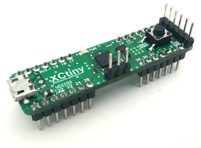

<a class="document_button" href="doc/XCtiny_DS_latest-EN.pdf">Datasheet</a>

The *XCtiny* is a homebrew evaluation board intended for use on .100" pin-pitch solderless breadboards, featuring the XC2C32A 32-macrocell CPLD from Xilinx®. Despite its small form factor, this board is still fit for hand-assembly by hobbyists, and can be used to implement glue logic with level-shifting capability. 

A Micro-B connector is provided for easy power supply from a PC or rechargeable battery pack. External power up to 6.0V can be supplied via breadboard pin. Reverse-polarity protection and EMI suppression included on-board. Two LDOs provide the necessary supply rails for Core and IO voltages, with the IO Bank 2 voltage level being user-selectable between LVCMOS33 and LVCMOS18 via jumper link. Regarding the maximum voltage tolerance of the IO Banks, please refer to the CPLD manufacturer's [Application Note XAPP429](https://www.xilinx.com/support/documentation/application_notes/xapp429.pdf) and [support database entry AR#13520](https://www.xilinx.com/support/answers/13520.html).

Two clock sources are connected to the CPLD: 8 MHz and 7.8125 kHz, allowing for implementation of state machine based designs. The low-speed clock signal is derived from the main 8 MHz MEMS oscillator using a 1:1024 clock divider IC. This signal can be used to free up macrocells otherwise occupied by clock dividers when in need of slow clock speeds.

An SPST push button is connected to the Global Set/Reset input of the CPLD via an on-board debounce filter, primarily intended as an active-low reset signal. It can be reconfigured for use as a general purpose input.

Further peripherals, such as IO LEDs, displays or DIP switches were omitted in the design, in order to keep the board footprint small (hence "tiny"), and to maximize the number of IO pins available to the user.

The device can be programmed via a JTAG header. Additionally, both data lines of the Micro-B connector are fanned out to an unpopulated 2mm pin-pitch header footprint, allowing for possible future development of an OBP daughtercard.

## PCB source files
The board was designed using the free CircuitMaker® application from Altium®. All source files are available as *open source* from the public online project repository: 

<a href="https://circuitmaker.com/Projects/Details/inselcontroller/XCtiny">https://circuitmaker.com/Projects/Details/inselcontroller/XCtiny</a>

## Documentation
Everything needed to get started making new projects with the *XCtiny* development board:
* [*XCtiny* Datasheet](doc/XCtiny_DS_latest-EN.pdf)
* [User Constraints File Template](res/top_XCtiny_template.ucf)

## fritzing® part
A custom part for the popular fritzing breadboard layout tool is available for download from this repository. Components for Altium CircuitMaker, Autodesk® EAGLE and KiCad will be available soon!
* [fritzing Parts](res/XCtiny_fritzing_parts.zip)

## Example projects
A small collection of demo projects for those new to VHDL, or just looking for a quick design to download:
* Out-Of-Box demo
* 8-bit binary counter
* Binary to 7-segment LED display decoder
* Bidirectional 3.3V-to/from-1.8V bus level shifter

## Legal
This development board is intended for evaluation and development purposes in an electronics laboratory environment **only**. FCC and CE tests/verification pending. All trademarks and registered trademarks mentioned herein are the property of their respective owners.
